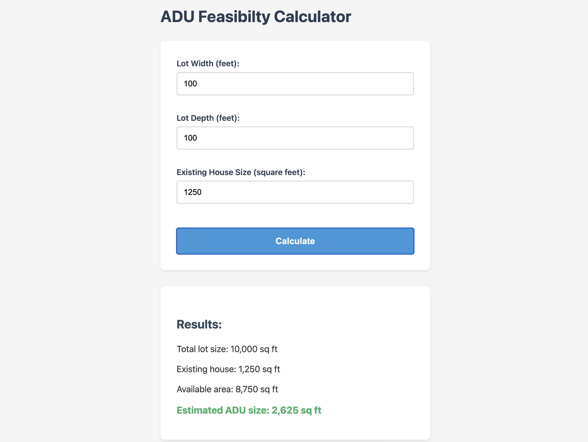

# ADU-Calculator

# ADU Feasibility Calculator

A simple web-based tool to help homeowners determine if an Accessory Dwelling Unit (ADU) will fit on their property.

## What It Does

Enter your lot dimensions and existing house size, and the calculator estimates:

- Total lot area
- Available space after accounting for your house
- Approximate ADU size (30% of available area)

## Why I Built This

I was researching ADUs for my own property and got tired of manually calculating feasibility. This tool provides a quick first-pass answer to "Will an ADU fit on my lot?"

## Current Status

**Version 1.0** - Basic calculator with clean styling

- Working calculation
- Responsive design
- External CSS
- Semantic HTML

## Try It

1. Clone this repository
2. Open `index.html` in your browser
3. Enter your lot dimensions
4. Click Calculate

## Limitations

- Assumes rectangular lots
- Uses simplified 30% calculation for ADU size
- Does not account for:
  - Setback requirements
  - Zoning regulations
  - Height restrictions
  - Parking requirements
  - Irregular lot shapes

## Roadmap

**Version 2 (Planned):**

- Visual diagram showing lot layout
- Cost estimation
- Irregular lot support

**Version 3 (Future):**

- City-specific zoning rules
- Permit cost estimation
- ROI calculator for rental scenarios

## Technical Details

Built with:

- HTML5 (semantic markup)
- Vanilla JavaScript (no frameworks)
- CSS3 (external stylesheet)

No dependencies. No build process. Just open and use.

## Contributing

This is a learning project, but suggestions welcome! Open an issue if you find bugs or have ideas.

## License

MIT License - See LICENSE file for details

## Author

Built by Eric Hutchison as part of learning web development.

Project started: January 2026
